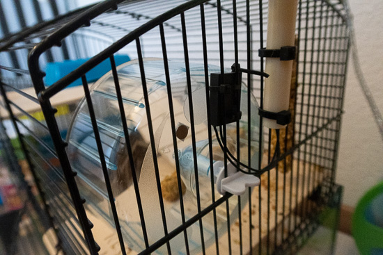
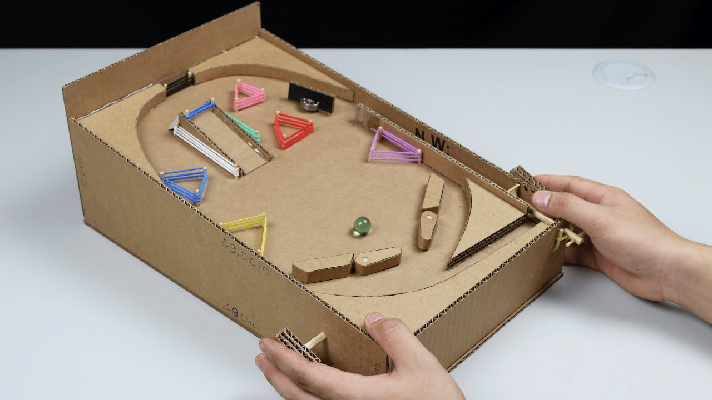
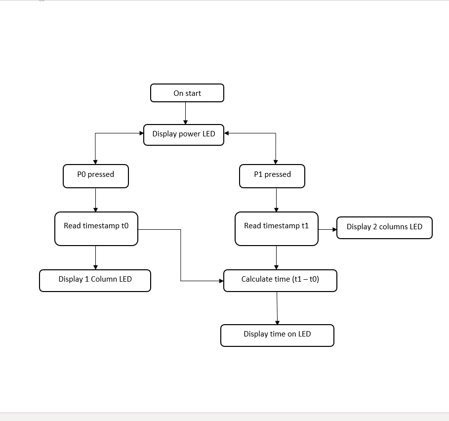

# Assessment 1: Replication project

## Replication project choice ##
Timing Gates using MicroBit

## Related projects ##
*Find about 6 related projects to the project you choose. A project might be related through  function, technology, materials, fabrication, concept, or code. Don't forget to place an image of the related project in the* `replicationproject` *folder and insert the filename in the appropriate places below. Copy the markdown block of code below for each project you are showing, updating the number* `1` *in the subtitle for each.*

### Related project 1 ###
Worlds Greatest Marble Race

https://www.instagram.com/p/B-RAepFn2P7/

This project is related to mine because my Prototype 1 and this marble race set up are very similar. I wanted to use a aluminium foil ball to trigger the timing gates, and the same principle can be applied here too. Probably an LDR or a motions sensing set up for the race will be more efficient.

### Related project 2 ###
A speedometer for hamsters

http://www.yoctopuce.com/EN/article/a-speedometer-for-hamsters

This project is related to mine because the project uses a reed switch and magnets to measure the speed while my project uses timing gates. 

### Related project 3 ###
Homemade pinball

https://www.youtube.com/watch?v=kLyXSEzyotY

This project is related to mine as this could be one of the potential gamified applications of the timing gates. While the timing aspect of the gates need not be necessary, the timing gates could be used as a switch and made to initiate various parts of the pinball machine.

## Reading reflections ##
*Reflective reading is an important part of actually making your reading worthwhile. Don't just read the words to understand what they say: read to see how the ideas in the text fit with and potentially change your existing knowledge and maybe even conceptual frameworks. We assume you can basically figure out what the readings mean, but the more important process is to understand how that changes what you think, particularly in the context of your project.*

*For each of the assigned readings, answer the questions below.*

### Reading: Don Norman, The Design of Everyday Things, Chapter 1 (The Psychopathology of Everyday Things) ###

*What I thought before: Describe something that you thought or believed before you read the source that was challenged by the reading.*

*What I learned: Describe what you now know or believe as a result of the reading. Don't just describe the reading: write about what changed in YOUR knowledge.*

*What I would like to know more about: Describe or write a question about something that you would be interested in knowing more about.*

*How this relates to the project I am working on: Describe the connection between the ideas in the reading and one of your current projects or how ideas in the reading could be used to improve your project.*

### Reading: Chapter 1 of Dan Saffer, Microinteractions: Designing with Details, Chapter 1 ###

*What I thought before: Describe something that you thought or believed before you read the source that was challenged by the reading.*

*What I learned: Describe what you now know or believe as a result of the reading. Don't just describe the reading: write about what changed in YOUR knowledge.*

*What I would like to know more about: Describe or write a question about something that you would be interested in knowing more about.*

*How this relates to the project I am working on: Describe the connection between the ideas in the reading and one of your current projects or how ideas in the reading could be used to improve your project.*

### Reading: Scott Sullivan, Prototyping Interactive Objects ###

*What I thought before: Describe something that you thought or believed before you read the source that was challenged by the reading.*

*What I learned: Describe what you now know or believe as a result of the reading. Don't just describe the reading: write about what changed in YOUR knowledge.*

*What I would like to know more about: Describe or write a question about something that you would be interested in knowing more about.*

*How this relates to the project I am working on: Describe the connection between the ideas in the reading and one of your current projects or how ideas in the reading could be used to improve your project.*

## Interaction flowchart ##

## Process documentation

#### Thinking beyond the basics ####

The timing gates by itself was a very simple and self explanatory project. It had a simple mechanisim that just required for a circuit to be completed through contacts touching both the ground and the pin, the LEDs would light up. Most projects over the internet either had a car or some vehicle going over the timing gates. I wanted to go at least one step beyond the basic structure of the experiment with maximum original thought, design and development.

##### Prototype 1 - (Not) Blown away #####
Favouring the fun side of games and toys, I made a simple toy using a styrofoam and some aluminium foil. With a foil ball on the valley of the styrofoam, the goal was that two people blow the ball from either side so as to make the ball reach either side and score a goal. The aluminium ball would have to complete the circuit and display the notification on the LED. While I proceeded to make it into a a game with gates on each side like goals, I decided to drop the whole idea in the hopes of making a better product. While the initial prototype worked, it's form was short lived.

   

##### Prototype 2 - Hamster Clock #####
While I did not want to use the same linear method of using a car and a flat track, I wanted to change the structure that can be made into something fun. A hamster wheel was one of the few ideas I had to implement this. With 3D printing being one of my go to tools for prototyping, I had quite some difficulty in trying to design a hamster wheel given that my profeciency in 3D design wasn't that great. While I did get a model I wanted from Thingiverse,(https://www.thingiverse.com/thing:2703459) it did not feel original to do this and also I decided that it would be better to build something using cardboard at this stage.

 

##### Beta Prototype #####
Getting to the final design took quite a bit thought. I did not want to have a wire attached to the appratus, not did I want to have a breadboard. So I had to strip it all off and just use some wires and aluminium strips as the conductors for the whole experiment. My aim was to make it as simple and as re-constructible as possible and also the current state did not allow me to get any more materials than I already had at home. 

*This should have quite a lot of information!*

*There will likely by a dozen or so images of the project under construction. The images should help explain why you've made the choices you've made as well as what you have done. Use the code below to include images, and copy it for each image, updating the information for each.*

*Include screenshots of the code you have used.*

## Project outcome ##

*Complete the following information.*

### Project title ###

### Project description ###

*In a few sentences, describe what the project is and does, who it is for, and a typical use case.*

### Showcase image ###

*Try to capture the image as if it were in a portfolio, sales material, or project proposal. The project isn't likely to be something that finished, but practice making images that capture the project in that style.*

### Additional view ###

*Provide some other image that gives a viewer a different perspective on the project such as more about how it functions, the project in use, or something else.*

### Reflection ###

*Describe the parts of your project you felt were most successful and the parts that could have done with improvement, whether in terms of outcome, process, or understanding.*

*What techniques, approaches, skills, or information did you find useful from other sources (such as the related projects you identified earlier)?*

*What ideas have you read, heard, or seen that informed your thinking on this project? (Provide references.)*

*What might be an interesting extension of this project? In what other contexts might this project be used?*
