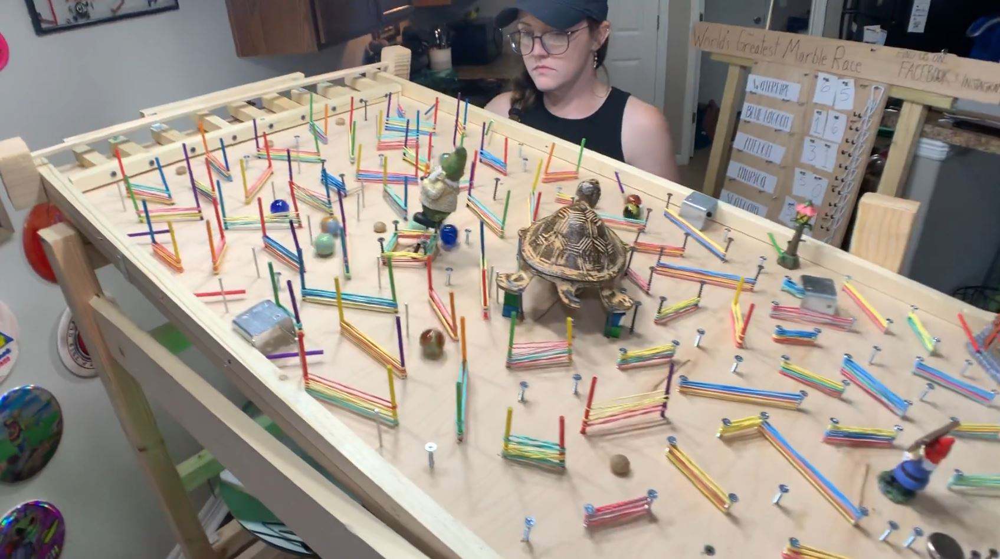

# Assessment 1: Replication project

## Replication project choice ##
Timing Gates using MicroBit

## Related projects ##

### Related project 1 ###
Worlds Greatest Marble Race

https://www.instagram.com/p/B-RAepFn2P7/

This project is related to mine because my Prototype 1 and this marble race set up are very similar. I wanted to use a aluminium foil ball to trigger the timing gates, and the same principle can be applied here too. Probably an LDR or a motions sensing set up for the race will be more efficient.

### Related project 2 ###
A speedometer for hamsters

http://www.yoctopuce.com/EN/article/a-speedometer-for-hamsters

This project is related to mine because the project uses a reed switch and magnets to measure the speed while my project uses timing gates. 

### Related project 3 ###
Homemade pinball

https://www.youtube.com/watch?v=kLyXSEzyotY

This project is related to mine as this could be one of the potential gamified applications of the timing gates. While the timing aspect of the gates need not be necessary, the timing gates could be used as a switch and made to initiate various parts of the pinball machine.

## Reading reflections ##
*Reflective reading is an important part of actually making your reading worthwhile. Don't just read the words to understand what they say: read to see how the ideas in the text fit with and potentially change your existing knowledge and maybe even conceptual frameworks. We assume you can basically figure out what the readings mean, but the more important process is to understand how that changes what you think, particularly in the context of your project.*

*For each of the assigned readings, answer the questions below.*

### Reading: Don Norman, The Design of Everyday Things, Chapter 1 (The Psychopathology of Everyday Things) ###

*What I thought before: Describe something that you thought or believed before you read the source that was challenged by the reading.*

I did not count feedback to be one of the important parameters when we design. I was aware of affordances and signifiers, but feedback was not in my sight.

*What I learned: Describe what you now know or believe as a result of the reading. Don't just describe the reading: write about what changed in YOUR knowledge.*

Feedback seems like a very obvious concept but I never have thought about this from such perspective. I often complain about lag and latency in videogames and videostreams, but this latency in products and designs responding to us has never struck me as a problem, partly because of my cultural conditioning I guess. I am thought to adjust rather than question back, now I feel feedback is more than a design concept. I am beginning to think how many oppurtuities and design problems I have walked past because I was okay with minimal or no feedback. 

*What I would like to know more about: Describe or write a question about something that you would be interested in knowing more about.*

I would love to know about how cultural differences influence these design choices. How westernized are the conceptual models for electronic household items?

*How this relates to the project I am working on: Describe the connection between the ideas in the reading and one of your current projects or how ideas in the reading could be used to improve your project.*

Having developed a project that shows the speed of a moving objects, especially the speed of a Hamster, how do I make the hamster realize it is going way too fast for its own good? Do I flash some light, or sound an alarm? Would the hamster take into account this feedback at the moment? These would be the questions I have to ask myself If I am to design a project that will involve physical fatigue and physical activity.  

### Reading: Chapter 1 of Dan Saffer, Microinteractions: Designing with Details, Chapter 1 ###

*What I thought before: Describe something that you thought or believed before you read the source that was challenged by the reading.*

Microinteractions is not a stranger me, but the examples quoted in teh first chapter made me understand that I don't have the best grasp of microinteraction

*What I learned: Describe what you now know or believe as a result of the reading. Don't just describe the reading: write about what changed in YOUR knowledge.*

Microinteractions are vital for the functionality of product. The small meaningful actions impact how the product is used, utilised and thought about. Microinteractions have the ability to break or make a product/software.

*What I would like to know more about: Describe or write a question about something that you would be interested in knowing more about.*

I would like to see what are the Microinteractions of some objects we use in day-to-day life but don't realise it.
I would also like a more visual difference between signifiers and microinteractions

*How this relates to the project I am working on: Describe the connection between the ideas in the reading and one of your current projects or how ideas in the reading could be used to improve your project.*

Microinteraction has a direct relation to my project in terms where how my project suggests such and such behaviour to 

### Reading: Scott Sullivan, Prototyping Interactive Objects ###

*What I thought before: Describe something that you thought or believed before you read the source that was challenged by the reading.*

I never thought people would get scared at the sensors they had in that store. I felt weird, but in retrospect that is a very accidental signifier and it is truly a real and practical problem.

*What I learned: Describe what you now know or believe as a result of the reading. Don't just describe the reading: write about what changed in YOUR knowledge.*

My perspective about art and technology has changed so much. How people perceive artists and art has changed so much. I am not able to decipher if Scott thought he was doing art, but I think he does. The energy and accomplishment he does despite the very minimally significant action shows how tech is not farfetched thing anymore. Now the line between tech and art is becoming such a blur that I would try to equate Scott's achievements to that of how a painter would feel at the end of a painting. The feelingm that you've created something is an artist's joy. 

And after looking at this, I want to get into arduino as well. 

*What I would like to know more about: Describe or write a question about something that you would be interested in knowing more about.*

I would love to know where to start to get into arduino. I've seen many lego creations with arduino, would that be a good place to begin with?

*How this relates to the project I am working on: Describe the connection between the ideas in the reading and one of your current projects or how ideas in the reading could be used to improve your project.*

Here Scott feverishly tells us about the emotions and processes that were involved in his prototyping method. From buying sensors that did more than motion sensing to finding a purpose to use the tech is all a lesson in prototyping. I found this refreshingly useful as it details the hardships of how his project scaled up and how he managed it all.

## Interaction flowchart ##

## Process documentation

#### Thinking beyond the basics ####

The timing gates by itself was a very simple and self explanatory project. It had a simple mechanisim that just required for a circuit to be completed through contacts touching both the ground and the pin, the LEDs would light up. Most projects over the internet either had a car or some vehicle going over the timing gates. I wanted to go at least one step beyond the basic structure of the experiment with maximum original thought, design and development.

##### Prototype 1 - (Not) Blown away #####
Favouring the fun side of games and toys, I made a simple toy using a styrofoam and some aluminium foil. With a foil ball on the valley of the styrofoam, the goal was that two people blow the ball from either side so as to make the ball reach either side and score a goal. The aluminium ball would have to complete the circuit and display the notification on the LED. While I proceeded to make it into a a game with gates on each side like goals, I decided to drop the whole idea in the hopes of making a better product. While the initial prototype worked, it's form was short lived.

 
 
 

##### Prototype 2 - Hamster Clock #####
While I did not want to use the same linear method of using a car and a flat track, I wanted to change the structure that can be made into something fun. A hamster wheel was one of the few ideas I had to implement this. With 3D printing being one of my go to tools for prototyping, I had quite some difficulty in trying to design a hamster wheel given that my profeciency in 3D design wasn't that great. While I did get a model I wanted from Thingiverse,(https://www.thingiverse.com/thing:2703459) it did not feel original to do this and also I decided that it would be better to build something using cardboard at this stage.

 

##### Beta Prototype #####
Getting to the final design took quite a bit thought. I did not want to have a wire attached to the appratus, not did I want to have a breadboard. So I had to strip it all off and just use some wires and aluminium strips as the conductors for the whole experiment. My aim was to make it as simple and as re-constructible as possible and also the current state did not allow me to get any more materials than I already had at home. 

Materials Used
1. Cardboard
2. Thread
3. Cellophane tape
4. Double-sided tape
5. Padding sponge
6. Wooden sticks from table-mat
7. Old paper

Having decided not to buy any thing extra for my project, I decided to go with the above mentioned items to build my prototype. 
I started with a basic stand for the barrel part the hamster wheel. I initially built it with the wooden sticks but they were unbalanced and it was quite hard to hoist surfaces required for the functioning of the project. While the sticks were sturdy enough, they were too rigid. The sticks were perfect for the spindle of the barrel. Building a short cross shaped structure with thread and some cellotape perpendicular to long sticks, I was able to build a spindle strong enough to hold the barrel without tipping or sagging. 

The barrel was built using cutouts from strong cardboard boxes. The frame though is all cardboard has mulitple parts that were put together to allow the aluminium foil contacts to be right below the barrel without scraping against the barrel. It was also build such that the battery could be housed inside the frame without being a distraction.

 

The circuit required only 3 volts of power which was supplied through 2 AAA batteries. 

##### Code #####

The code for this project was written using MicroBit Make Code Blocks interface. When the Pin 0 of MicroBit reads an input, the timestamp is stored as t0. It also displays a symbol on the MicroBit LED screen. When Pin 1 reads an input, the corresponding timestamp is stored as t1. Then the speed is c calculated using the formula (t1-t0). Then the result is displayed on the LED screen.

 

## Project outcome ##

https://youtu.be/CwswVV3VV8M

### Project title ###

Hamster Clock

### Project description ###

Hamster clock is a device that can be used to find the speed at which your Hamster's hamster wheel is spinning. It is just a fun way to see how athletic your hamster is
### Showcase image ###

 

Explanation Video: https://youtu.be/FlIByP4fRYY

### Additional view ###

 
 

### Reflection ###

*Describe the parts of your project you felt were most successful and the parts that could have done with improvement, whether in terms of outcome, process, or understanding.*

The most successful part about this whole exercise is that I learnt the process, time and effort it takes to go through prototypes. The number of challenges that pop-up regardless of its size doubles for every prototype I did. The part that I feel could have been better was how I could have planned this from the perspective of visuals also. I went for a barebones look which I desperatel tried to hide with some random objects but was rather unsuccessful at that. I also feel that I could have built it a bit bigger. 

The whole prototype works. It does what it was intended to, but the parameters, limitations, affordances, signifiers have not been explored yet. Structural integrity, basic skeleton, and functional profeciency was the major focus throughout this experiment. 

Asking opinions about this to my housemates and girlfriend, they were not too impressed with it but loved my idea of making this hamster wheel into a roulette table of some sorts so that we all can play. This also showed me that human interactions often takes the precedence in building toys or fun things like this. 

*What techniques, approaches, skills, or information did you find useful from other sources (such as the related projects you identified earlier)?*

Having learnt about the need to document our process, I tried to be conscious of recording what I did. I started out well but I lost track and thought realized I had missed documenting the first few days of effort. 
Wanting to be original about this, I tried be not influenced by other models that might use the same concept and application. I tried to be as original as possible in terms of design and execution. 
I had to force myself to let go of the flat structure that had occupied my mind. Arriving at the wheel based form took some thinking, though it might not be the best execution.

*What ideas have you read, heard, or seen that informed your thinking on this project? (Provide references.)*

My research on timing gates and other simimlar concepts did not throw many hamster wheel projects. But there where a few possibilities where the timing gates and could have been used in a different form.

The roulette idea and using a part of the timing gate concept for a roulette wheel was fascinating. Multiple timing gates could simply be used to denote differnt parts of the roulette board. Since the cicuit needs specific amount of contact, the speed of spinning could decide a winner
Link: https://www.youtube.com/watch?v=mza4Sre9LHM

The reaction time game that also used MicroBit is another dimension of how the timing gates can be used as a game 
Link: https://www.youtube.com/watch?v=DgJ-S0q0EMs

There were also many very simple, quick methods to do hamster wheel. Example: 
Link: https://www.youtube.com/watch?v=ZeuJ66PWsks

*What might be an interesting extension of this project? In what other contexts might this project be used?*

I would like to see a human sized hamster wheel and people competing over who's the fastest. Another fun radical idea from this project would to create a speed activated rolling door prank. Unless people rotate the door at a certain speed before entering, the door wouldn't open. This project can also be used to create diy windmills that show speed. 

A simple homemade speedometer for bicycle is another application of timing gates. 
